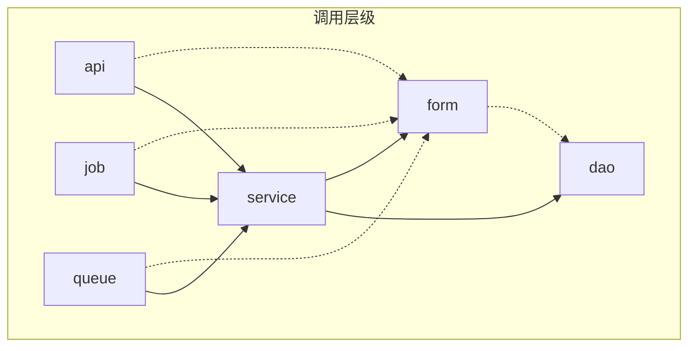

# apps结构
* app
  * internal
    * common
      * local
      * errcode
      * enum
      * dao
    * admin
      * api
      * service
      * init.go
    * \<serviceName\>
      * api
      * form
      * service
      * dao
      * job
      * queue
      * init.go
    * ...
  * initial_app.go
* app2
  * ...
* init_apps.go // 加载各个app（路由初始化, 定时任务, 队列等初始化）

*做到各个app互相独立*

*每个app包含完整的功能（报表, 配置, 管理, 参数options等 ）*

---------------------------------

# 异常处理

错误就近在含有logger对象的调用者处处理, 并在最外层(如api, job, queue)再次处理(作为保底, 避免遗漏)

---------------------------------

# 调用层级
虚线表示仅依赖其结构; 实线表示调用结构及方法

